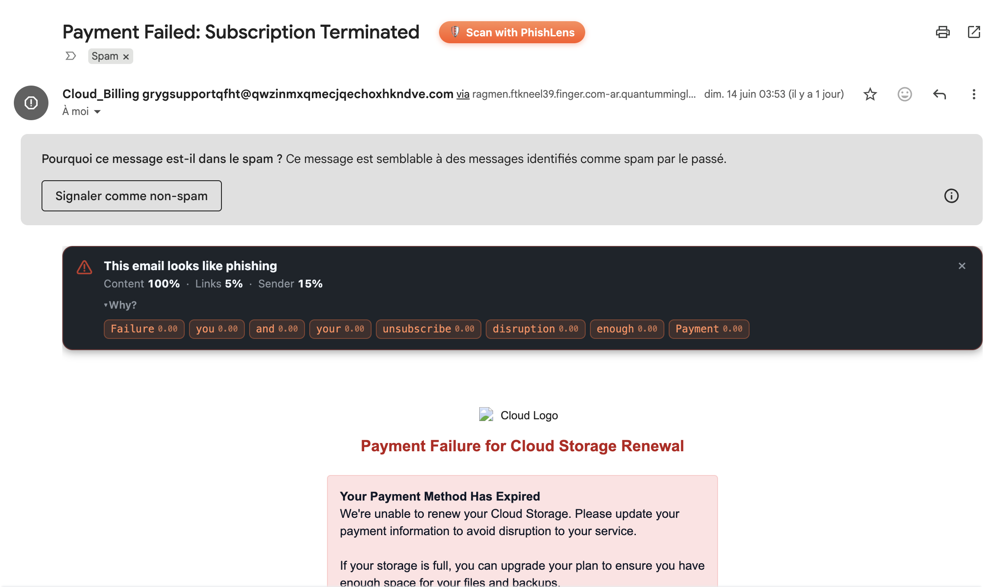
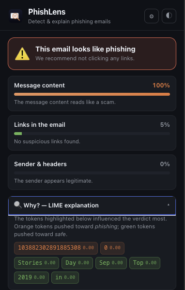
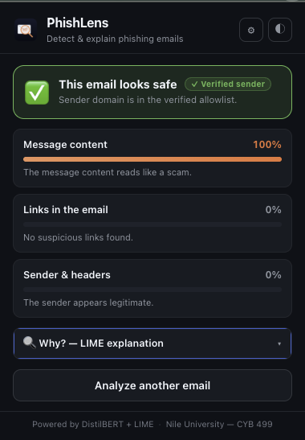
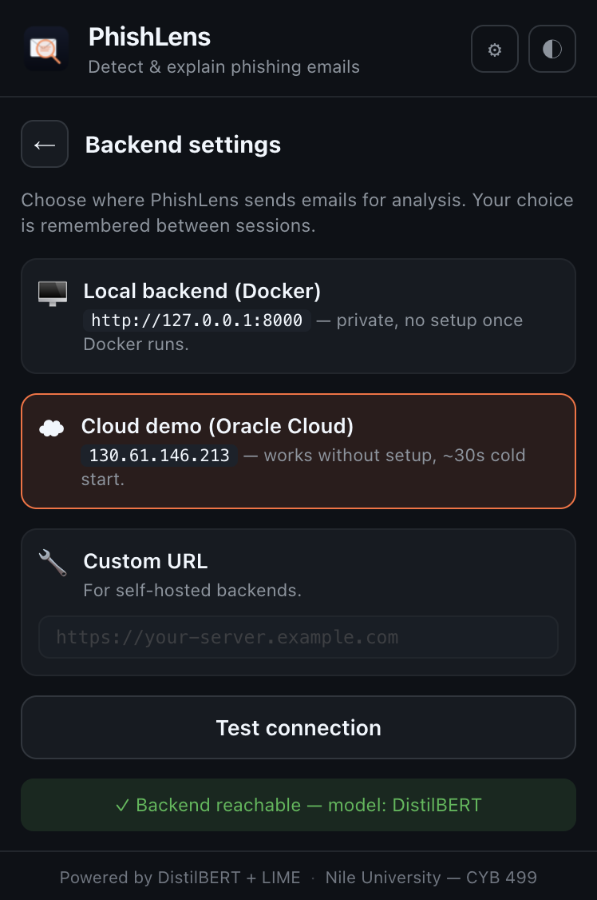

<div align="center">


# PhishLens

**Detect and explain phishing emails — in real time, inside your browser.**

A fine-tuned DistilBERT text classifier, two trained Random Forest agents
(URLs, headers), an RFC-7489 sender-authentication path (SPF / DKIM / DMARC),
a multi-source URL reputation cascade (Google Safe Browsing, PhishTank,
URLhaus, Spamhaus DBL), **per-attachment scanning** for PDF and HTML files,
and a LIME explanation panel — wrapped in a Chrome extension that injects
directly into Gmail.

[](https://www.python.org/)
[](https://fastapi.tiangolo.com/)
[](https://pytorch.org/)
[](https://developer.chrome.com/docs/extensions/mv3/intro/)
[](LICENSE)
[](https://github.com/AnzouK/PhishLens/releases/latest)
[](https://anzouk.duckdns.org)
[](https://huggingface.co/AnzouKiona/phishlens-distilbert)
[](https://huggingface.co/AnzouKiona/phishlens-agents)

<br/>



</div>

---

## ✨ What it does

PhishLens injects a **🛡 Scan with PhishLens** button next to the subject of
every open Gmail message. One click runs the three agents and drops a verdict
banner directly into the Gmail UI — Safe or Phishing, with per-agent scores
and a collapsible LIME explanation. You can also open the extension popup to
analyse an arbitrary `.eml` file or raw pasted text.

The text agent is a **DistilBERT fine-tuned on ~30k emails** drawn from
multiple public phishing corpora. On the held-out test split it reaches
**F1 ≈ 0.97** with a ~3% false-positive rate — and the LIME explanation
tells you which tokens pushed the verdict that way.

<table align="center">
  <tr>
    <td align="center">
      <br/>
      <sub><em>Phishing verdict — 3 agents + LIME tokens.</em></sub>
    </td>
    <td align="center">
      <br/>
      <sub><em>Safe verdict — verified-sender pill when SPF/DKIM/DMARC align.</em></sub>
    </td>
  </tr>
</table>

---

## 🏗 Architecture

```
┌──────────────────────────────────────┐      ┌──────────────────────────────────────┐
│         Chrome extension (MV3)       │      │        FastAPI backend (Docker)      │
│                                      │      │                                      │
│  ┌──────────┐     ┌───────────────┐  │      │  ┌────────────────────────────────┐  │
│  │  Popup   │     │ Gmail content │  │ POST │  │  DistilBERT     text agent     │  │
│  │  + LIME  │     │   script      │──┼──────┼─▶│  RF (23 feats)  URL agent      │  │
│  │  cache   │     │ (MutationObs) │  │      │  │  RF (37 feats)  metadata agent │  │
│  └──────────┘     └───────────────┘  │      │  └────────────────────────────────┘  │
│         ▲                 ▲          │      │                 │                    │
│         │                 │          │      │                 ▼                    │
│         └──── Background service     │      │  ┌────────────────────────────────┐  │
│             (CSP-bypass fetch proxy  │      │  │  Sender auth  (SPF/DKIM/DMARC) │  │
│              + warm-up alarm)        │      │  │  URL reputation cascade:       │  │
│                                      │      │  │    cache → GSB → PhishTank →   │  │
│  Local storage:                      │      │  │    URLhaus → Spamhaus DBL      │  │
│    - scan history   (500 entries)    │      │  └────────────────────────────────┘  │
│    - LIME cache     (200 entries)    │      │                 │                    │
│    - theme / backend selection       │      │                 ▼                    │
│    - analytics dashboard state       │      │  ┌────────────────────────────────┐  │
│                                      │      │  │  Weighted fusion + LIME        │  │
│  Trust signals shown in the UI:      │      │  │  paths: crypto_verified,       │  │
│    DKIM verified   (crypto path)     │      │  │         gmail_inbox_soft,      │  │
│    Gmail-delivered (soft path)       │      │  │         trusted allowlist,     │  │
│    Verified sender (allowlist)       │      │  │         default                │  │
│    chips per intel source flagged    │      │  └────────────────────────────────┘  │
│                                      │      │                 │                    │
│                                      │      │                 ▼                    │
│                                      │      │            verdict + LIME            │
└──────────────────────────────────────┘      └──────────────────────────────────────┘
```

The trained URL and metadata Random Forest agents live in a sibling repo
([dodi-ctrl/PhishingDetector](https://github.com/dodi-ctrl/PhishingDetector))
and are pulled at startup from Hugging Face
([`AnzouKiona/phishlens-agents`](https://huggingface.co/AnzouKiona/phishlens-agents)).
The runtime image ships with heuristic fallbacks so the pipeline still runs
end-to-end when the joblib artefacts aren't reachable.

---

## 🚀 Quickstart

You have three options. The extension's gear (⚙) menu lets you switch
between them at any time without reloading.

<div align="center">
  
</div>

### Option 0 · Cloud demo (zero setup)

Just install the extension, switch the backend to **Cloud demo** in the
gear menu, and you're done. The popup calls
[`https://anzouk.duckdns.org`](https://anzouk.duckdns.org) — an Oracle
Cloud Always Free VM (ARM Ampere A1, 4 OCPU / 24 GB RAM) running the same
FastAPI Docker image as Option 1, behind Caddy with a Let's Encrypt
certificate auto-renewed.

Caveats: CPU-only inference (~3–5 s per `/analyse`), shared instance —
don't paste sensitive email content. The VM runs continuously (no cold
start). For a fully self-hosted deployment on your own domain, use Option 1.

### Option 1 · Docker (recommended for daily use)

```bash
# 1. Get the model files into ./backend/model/ (one-time)
mkdir -p backend/model
huggingface-cli download AnzouKiona/phishlens-distilbert --local-dir backend/model

# 2. Bring the backend up
cd backend
docker compose up --build
```

After ~30 seconds you should see `Model loaded on device=cpu. Ready on http://0.0.0.0:8000`.

### Option 2 · Manual Python install (without Docker)

```bash
cd backend
python3 -m venv venv
source venv/bin/activate            # Windows: venv\Scripts\activate
pip install -r requirements.txt
uvicorn extension_backend:app --host 127.0.0.1 --port 8000
```

The first call will warm DistilBERT (~3 s on Apple Silicon via MPS, ~6 s on CPU).

### Load the Chrome extension

1. Open `chrome://extensions`
2. Toggle **Developer mode** (top-right)
3. Click **Load unpacked**
4. Select the `extension/` folder
5. The PhishLens icon appears in your toolbar.

---

## 🎯 Usage

### Popup mode

Click the PhishLens icon. Two tabs:

- **📂 File** — drop or browse a `.eml` file (e.g. from Gmail's "Download message")
- **📝 Paste** — paste raw email body text, with optional clipboard button

Both produce a verdict + 3-agent breakdown + collapsible LIME explanation.

### Gmail auto-scan

When you visit `https://mail.google.com` and open any email, a small orange
**🛡 Scan with PhishLens** pill appears next to the subject line. Clicking it
runs the same pipeline and injects a verdict banner above the email body —
without leaving Gmail.

### Theme

The popup has a ◐ toggle (dark/light). Your choice is broadcast through
`chrome.storage.local`, so the Gmail-injected banner uses the same theme.
Default is to follow your OS dark-mode preference.

---

## ⚙️ Configuration

### Environment variables

| Variable                       | Default                         | Purpose                                                                                                    |
|--------------------------------|---------------------------------|------------------------------------------------------------------------------------------------------------|
| `MODEL_DIR`                    | `./model`                       | Path to the unzipped DistilBERT checkpoint                                                                 |
| `MODEL_DTYPE`                  | `float32`                       | Set to `float16` for a smaller memory footprint at the cost of a modest precision hit                      |
| `LIME_NUM_SAMPLES`             | `100`                           | Forward passes per `/explain` call. Higher = sharper explanation, slower                                   |
| `HF_MODEL_REPO`                | `AnzouKiona/phishlens-distilbert` | Hugging Face repo to pull the model from when `MODEL_DIR` is empty                                       |
| `HF_AGENTS_REPO`               | `AnzouKiona/phishlens-agents`   | Hugging Face repo hosting the trained URL / metadata Random Forest joblibs                                 |
| `GSB_API_KEY`                  | *(empty)*                       | Google Safe Browsing v4 API key — GSB tier is disabled without one                                         |
| `GSB_DAILY_LIMIT`              | `10000`                         | Daily GSB request budget                                                                                   |
| `GSB_SAFETY_BUFFER`            | `500`                           | Never spend the last N of the daily budget (leaves headroom)                                               |
| `REPUTATION_CACHE_DB`          | `/tmp/phishlens_reputation.db`  | SQLite file for the URL-reputation cache                                                                   |
| `REPUTATION_CACHE_TTL`         | `86400`                         | Cache TTL in seconds                                                                                       |
| `REPUTATION_ENABLE_GSB`        | `1`                             | Toggle Google Safe Browsing tier                                                                           |
| `REPUTATION_ENABLE_PHISHTANK`  | `1`                             | Toggle PhishTank tier                                                                                      |
| `REPUTATION_ENABLE_URLHAUS`    | `1`                             | Toggle URLhaus tier                                                                                        |
| `REPUTATION_ENABLE_DBL`        | `1`                             | Toggle Spamhaus DBL DNS lookups                                                                            |
| `PHISHTANK_REFRESH_S`          | `3600`                          | Background refresh interval for the PhishTank feed                                                         |
| `PHISHTANK_API_KEY`            | *(empty)*                       | Optional — bumps the rate limit for the PhishTank feed download                                            |

### Sender authentication (RFC 7489)

The v1.6+ backend parses the `Authentication-Results` header on every
message and computes organizational-domain alignment against the visible
`From:`. When the DKIM signature aligns with `From:`, the message is
considered **cryptographically verified** and gets the same discount as
the static allowlist:

- the text-agent weight halved in the fusion
- the high-confidence single-agent override disabled (except on a Google
  Safe Browsing URL hit — that still forces "phishing" even for a
  cryptographically-proven sender, since a signed message with a
  Safe-Browsing-listed link means the sender's account is compromised)
- the phishing threshold raised to 0.65

This is what stops DistilBERT from false-positiving on real hospital
lab-report, bank-KYC, or "verify your email" transactional messages that
share template wording with phishing, without the security hole of the
old allowlist — a spoofed `From: paypal.com` signed by `attacker.tld`
fails the alignment check and stays on the strict path.

### Static allowlist (fallback)

`extension_backend.py` still ships with a curated `TRUSTED_DOMAINS` set
of well-known institutional senders as a fallback for messages that
arrive without an `Authentication-Results` header. Edit the set to add
or remove entries. The runtime prefers cryptographic verification when
both signals are available.

### Fusion weights

Base weights applied on the default (unauthenticated) path:

| Knob                 | Default |
|----------------------|---------|
| `W_TEXT`             | `0.34`  |
| `W_URL`              | `0.33`  |
| `W_META`             | `0.33`  |
| `FUSION_THRESHOLD`   | `0.5`   |
| `HIGH_CONF_OVERRIDE` | `0.85`  |

The four sender-trust paths override some of these knobs. Summary:

| Path                       | Text weight  | Single-agent override        | Threshold |
|----------------------------|--------------|------------------------------|-----------|
| `trusted_sender` (allowlist) | `W_TEXT × 0.5` | disabled                     | `0.65`    |
| `crypto_verified` (DKIM aligned) | `W_TEXT × 0.5` | disabled (unless GSB match)  | `0.65`    |
| `gmail_inbox_soft` (Inbox-delivered) | `W_TEXT × 0.6` | disabled (unless GSB match)  | `0.62`    |
| default                    | `W_TEXT × 1.0` | on when any agent ≥ `0.85`   | `0.5`     |

A Google Safe Browsing hit on any URL forces the phishing verdict regardless
of the path (a signed message with a Safe-Browsing-listed link means the
sender's account is compromised).

---

## 📁 Project layout

```
PhishLens/
├── backend/                      # local Docker deployment
│   ├── extension_backend.py      # FastAPI app (/analyse, /explain, /analyse_attachment, /reputation/stats)
│   ├── auth_headers.py           # SPF/DKIM/DMARC parser + Spamhaus DBL DNS lookup
│   ├── reputation.py             # URL reputation cascade — GSB / PhishTank / URLhaus / DBL
│   ├── attachment_analysis.py    # PDF (pdfplumber) + HTML (bs4) extraction + feature flags
│   ├── feature_extraction.py     # feature engineering for the trained RF agents
│   ├── url_agent.py              # trained URL Random Forest wrapper (from PhishingDetector)
│   ├── metadata_agent.py         # trained metadata Random Forest wrapper
│   ├── Dockerfile
│   ├── docker-compose.yml
│   ├── requirements.txt
│   └── model/                    # DistilBERT — NOT tracked by git
├── space/                        # cloud deployment (Oracle VM / HF Space)
│   └── ...                       # mirrors backend/ with the cloud-specific Dockerfile
├── extension/
│   ├── manifest.json             # MV3 manifest
│   ├── background.js             # service worker (CSP-bypass fetch proxy + warm-up alarm)
│   ├── popup/                    # popup UI (HTML/CSS/JS, no build step)
│   ├── content_scripts/          # Gmail injection + banner CSS
│   ├── lib/
│   │   ├── history.js            # scan history + analytics (chrome.storage.local)
│   │   └── lime_cache.js         # SHA-256-keyed LIME response cache
│   └── icons/                    # PNG + SVG
├── docs/                         # screenshots, UML diagrams
└── README.md
```

---

## 🧰 Tech stack

- **Backend:** FastAPI · PyTorch · Hugging Face Transformers · scikit-learn · LIME · NumPy · httpx
- **Model:** DistilBERT fine-tuned on a multi-source phishing email corpus
- **Extension:** Vanilla HTML/CSS/JS · Chrome MV3 · no build step
- **Inference acceleration:** Apple Silicon MPS · CUDA · CPU fallback

---

## 🎓 Academic context

Final-year project for the **B.Sc. Cybersecurity** programme,
[Nile University of Nigeria](https://nileuniversity.edu.ng/),
Department of Cybersecurity, session 2025–2026.

---

## 🗺 Roadmap

### ✅ Shipped in v1.4.0
- [x] Cloud backend migrated to a self-managed Oracle Cloud VM (24 GB RAM, always-free)
- [x] Model loaded in FP32 by default for faster CPU inference (~5 s → ~3 s per `/analyse`)
- [x] LIME sample budget cut from 200 → 100 (~15 s → ~8 s per `/explain`), env-tunable
- [x] Verdict + explanation streamed asynchronously in the UI (verdict shows in ~3 s while LIME loads in background)
- [x] Opt-in scaffolding for the trained URL / metadata Random Forest agents (`URL_RF_PATH` / `METADATA_RF_PATH` env vars)
- [x] `/health` endpoint for warm-up ping consistency across all deployments

### ✅ Shipped in v1.5.0
- [x] **Scan history dashboard** — `lib/history.js` module, `chrome.storage.local`-backed, capped at 500 entries; scans from Gmail, `.eml` upload and pasted text are auto-persisted
- [x] **In-popup analytics** — total scans, phishing %, average text score, Safe/Phishing ratio bar, 30-day timeline, top LIME phishing tokens, recent scans list, CSV / JSON export, one-click clear
- [x] **Trained URL & metadata Random Forest agents** — backend downloads `AnzouKiona/phishlens-agents` from Hugging Face at startup and uses `URLAgent.get_prediction_with_confidence()` / `MetadataAgent.get_prediction_with_confidence()`; heuristic fallback still runs when the joblibs aren't reachable

### ✅ Shipped in v1.6.x
- [x] **RFC-7489 sender authentication** — `auth_headers.py` parses the `Authentication-Results` header (SPF / DKIM / DMARC) and computes organizational-domain alignment against the visible `From:`. Static `TRUSTED_DOMAINS` allowlist is now a fallback, not the primary signal — a spoofed `From: paypal.com` signed by `attacker.tld` no longer passes the trust check.
- [x] **URL reputation cascade** — `reputation.py` layers `cache → Google Safe Browsing v4 (10 k/day) → PhishTank → URLhaus → Spamhaus DBL`, run in parallel with model inference. Reputation-hit URLs override the RF score (GSB match → `p_url = 0.95`); local SQLite cache with 24-h TTL absorbs repeat lookups.
- [x] **New `sender_auth` and `url_reputation` fields** in the `/analyse` response; new `GET /reputation/stats` endpoint for cache-hit rate and GSB quota monitoring.
- [x] **Popup + Gmail banner surface the new signals** — colour-coded chips per intel source, per-auth verdict; `🛡 DKIM verified` pill replaces the plain "trusted allowlist" pill when the sender is cryptographically proven.
- [x] **Gmail parity with popup scans** — content script scrapes Gmail's own `mailed-by` / `signed-by` DOM signals and forwards them to the backend as a synthesized `Authentication-Results`, so Gmail-injected scans and `.eml`-upload scans of the same message agree.
- [x] **Gmail-inbox soft-verification fallback** (v1.6.2) — when the DOM scrape fails but Gmail delivered the message to Inbox, we treat that as a weak trust signal (Gmail already ran SPF/DKIM/DMARC before delivery). The fusion halves the text weight and disables the single-agent override, so legitimate `Verify your email` templates no longer trigger false positives. `📬 Gmail-delivered` pill on the verdict card differentiates it from full crypto verification.
- [x] **Client-side LIME cache** — `lib/lime_cache.js`, SHA-256-keyed on `{backend, payload}` in `chrome.storage.local`. Re-opening the same email: `~10 s → ~50 ms`.

### ✅ Shipped in v1.7.0
- [x] **HTTPS + custom domain** — Caddy reverse proxy on the Oracle VM, DuckDNS domain `anzouk.duckdns.org`, Let's Encrypt certificate auto-renewed. The extension's Cloud demo preset now points to `https://anzouk.duckdns.org`; the raw IP `130.61.146.213` is kept in `host_permissions` for backward compatibility with existing installs.
- [x] **Landing page** at `https://anzouk.duckdns.org` — dark-themed single-file page served by Caddy on the same origin as the API. Live status pill queries `/health`, live backend stats query `/reputation/stats`, and a "Try it live" widget lets visitors paste an email body or upload a `.eml` and get the same verdict the extension produces.

### ✅ Shipped in v1.8.0 — Phase 1: attachment analysis
- [x] **PDF and HTML attachment analysis** — new `POST /analyse_attachment` endpoint. PDF text/URL extraction via `pdfplumber`, HTML via `BeautifulSoup`. Reuses the existing text agent + URL agent + reputation cascade on the extracted content. 10 MB hard cap, MIME sniffed from magic bytes.
- [x] **Feature-flag detection** — `contains_javascript`, `auto_execute_on_open`, `launch_external_action`, `embeds_another_file`, `submits_form_to_url`, `remote_link_action`, `flash_or_richmedia` for PDFs; `contains_form`, `contains_password_field`, `contains_iframe`, `meta_refresh_redirect` for HTML. Flags add a bounded score bonus (cap 0.7) and a `+0.10` combo bump when a form and a password field appear together.
- [x] **Gmail integration** — per-attachment `🛡 Scan` pill on every supported attachment tile. When a message has more than one supported attachment, a header `📎 Scan N attachments` button runs them sequentially with a `confirm()` past five and a hard cap at fifteen. Each scan produces its own mini-banner right below the tile with verdict, size, page count, URL count, notable feature chips, and reputation-hit chips.
- [x] **Popup and landing widgets** — file input accepts `.pdf` and `.html` in addition to `.eml`; routes to the correct endpoint automatically; attachment-specific chips (kind, size, page count, notable features) render alongside the agent scores.

### 🚧 Planned for next release — Phase 2 and 3
- [ ] **DOCX / XLSX support** — extract text + hyperlinks via `python-docx` and `openpyxl`; macro presence flagged as a hard red flag
- [ ] **Image OCR** — Tesseract OCR on images so hidden text inside login-page screenshots doesn't bypass the text agent
- [ ] **Basic steganography heuristics** — LSB chi-square test, EXIF thumbnail mismatch, file-size-vs-dimensions anomaly

### 🔭 Planned for v2.0 (medium-term)
- [ ] **Yahoo Mail** content script
- [ ] **Outlook Web** content script
- [ ] **Automatic background scan** of new Gmail messages, with a native Chrome notification when a phishing verdict is issued
- [ ] **Multi-architecture Docker images** (`linux/amd64` + `linux/arm64`) so `docker pull` just works everywhere
- [ ] **Multilingual DistilBERT** — extend beyond English to French / Hausa / Yoruba corpora

### 🔬 Research directions
- [ ] Quantized ONNX Runtime backend for sub-second `/analyse` on modest CPUs
- [ ] End-to-end evaluation on a live Gmail stream (out-of-distribution FPR / FNR)
- [ ] SHAP explanations as a stability comparator for LIME

---

## 📄 License

Released under the [MIT License](LICENSE).

---

## 🔗 Related repository

The model-training notebooks and the URL / metadata Random Forest agents
live at [**PhishingDetector**](https://github.com/dodi-ctrl/PhishingDetector).
