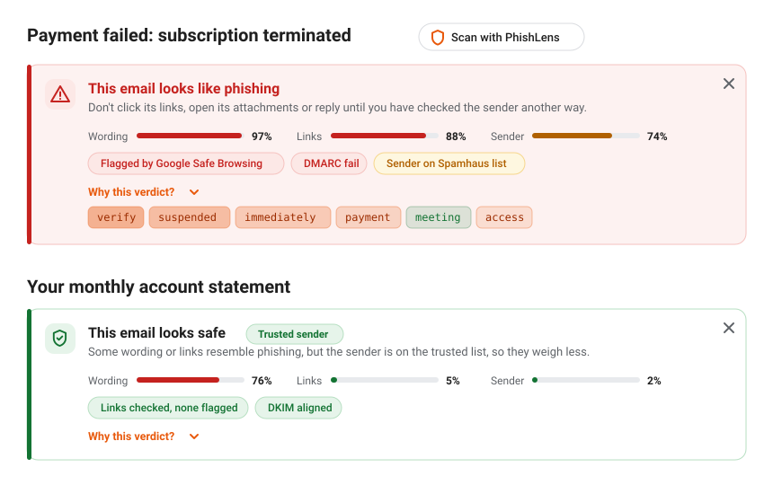
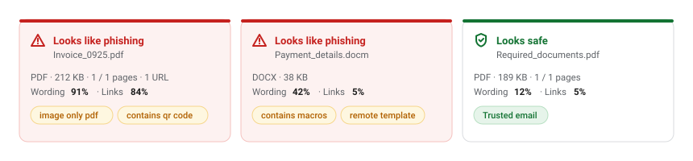
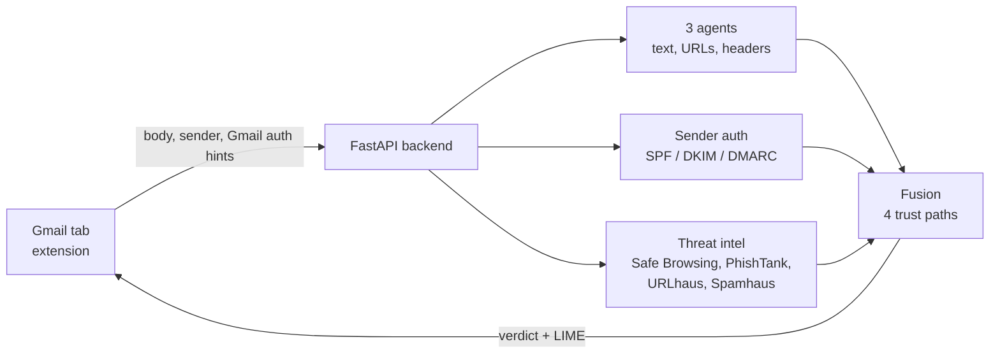
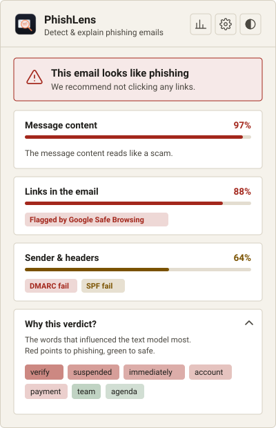

<div align="center">


# PhishLens

**Detect and explain phishing emails in real time, inside Gmail.**

[](https://github.com/AnzouK/PhishLens/actions/workflows/ci.yml)
[](https://github.com/AnzouK/PhishLens/releases/latest)
[](LICENSE)
[](https://anzouk.duckdns.org)
[](https://huggingface.co/AnzouKiona/phishlens-distilbert)

<picture>
  <source media="(prefers-color-scheme: dark)" srcset="docs/gmail-verdicts-dark.svg">
  
</picture>

</div>

PhishLens is a Chrome extension and a FastAPI backend that classify an
email as safe or phishing and show why. Three agents score each message
(a fine-tuned DistilBERT on the text, and two Random Forests on the links
and the headers), then the verdict is adjusted with real evidence:
SPF/DKIM/DMARC alignment and four threat-intelligence sources. A LIME
panel highlights the words that drove the decision. Attachments are
scanned too: PDFs (including scanned ones, through OCR), images, HTML
pages, Word / Excel / PowerPoint files, ZIP archives, calendar invites
and attached emails, with QR codes decoded and macros, executables,
password-protected archives and other dropper tricks flagged. The
scanner handles real-inbox cases: conversations, forwarded emails,
image-only emails and links hidden behind "Click here".

<div align="center">
  <picture>
    <source media="(prefers-color-scheme: dark)" srcset="docs/attachments-dark.svg">
    
  </picture>
  <br/>
  <sub><em>Attachment scan results under the attachment strip in Gmail.</em></sub>
</div>

## Results

**Detection** (held-out test sets; datasets and protocol in
[PhishingDetector](https://github.com/dodi-ctrl/PhishingDetector)):

| Agent | Model | Accuracy | F1 |
| --- | --- | --- | --- |
| Text | DistilBERT, fine-tuned on 29.5k emails | 97.34% | 0.967 |
| URL | Random Forest, 23 features | 99.34% | 0.991 |
| Metadata | Random Forest, 37 features | 99.92% | 0.999 |

**Latency** on PhishLens Cloud (Oracle Cloud ARM, 4 cores, CPU only,
[load test](docs/operations.md#load-testing) with 10 concurrent users):
`/analyse` median 77 ms, p95 280 ms, zero failures over 454 requests.

These are offline numbers. Real inboxes are harder; see the
[known limitations](docs/threat-model.md#residual-risks-and-known-limitations).

## How it works


```mermaid
flowchart LR
    G["Gmail tab<br/>extension"] -->|body, sender, Gmail auth hints| API["FastAPI backend"]
    API --> A["3 agents<br/>text, URLs, headers"]
    API --> S["Sender auth<br/>SPF / DKIM / DMARC"]
    API --> R["Threat intel<br/>Safe Browsing, PhishTank,<br/>URLhaus, Spamhaus"]
    A & S & R --> F["Fusion<br/>4 trust paths"]
    F -->|verdict + LIME| G
```

The key idea: DistilBERT alone flags real bank and university emails
because they use the same "verify your account" wording as phishing. So
the text score is discounted only when the sender is proven (DKIM aligned
with the From: domain) or curated, and a Safe Browsing hit on any link
forces "phishing" whoever the sender is. Details, diagrams and design
decisions: [docs/architecture.md](docs/architecture.md).

## Quickstart

**1. Load the extension.** Open `chrome://extensions`, turn on Developer
mode, click **Load unpacked** and pick the `extension/` folder.

**2. Pick a backend** in the extension's gear menu (PhishLens Cloud is
the default, so this step is optional):

| Option | Setup | When to use it |
| --- | --- | --- |
| PhishLens Cloud (default) | none | Normal use. Hosted server, nothing stored ([privacy policy](PRIVACY.md)). |
| Local Docker | commands below | Emails never leave your machine. |
| Local Python | commands below | Development. |

Local Docker:

```bash
mkdir -p backend/model
huggingface-cli download AnzouKiona/phishlens-distilbert --local-dir backend/model
cd backend && docker compose up --build
```

Local Python (3.12), with Tesseract installed for OCR (`brew install tesseract` or `apt install tesseract-ocr`):

```bash
cd backend
python3 -m venv .venv && source .venv/bin/activate
pip install torch --index-url https://download.pytorch.org/whl/cpu   # CPU build, not in requirements.txt
pip install -r requirements.txt
uvicorn extension_backend:app --host 127.0.0.1 --port 8000
```

The backend is ready when the logs show `Model loaded on device=cpu`.

## Usage

- **In Gmail:** open an email and click **Scan with PhishLens** next to
  the subject. The verdict appears above the body with per-agent scores,
  sender-authentication chips and a "Why?" panel. Emails with attachments
  get a **Scan N attachments** button.
- **In the popup:** drop a `.eml` file or an attachment (PDF, image,
  Word, Excel, PowerPoint, HTML, ZIP, .ics), or paste the text of an email.
- **History:** every scan is kept locally in the browser, with a small
  analytics view and CSV / JSON export.

<div align="center">
  <picture>
    <source media="(prefers-color-scheme: dark)" srcset="docs/popup-dark.svg">
    
  </picture>
</div>

## Configuration

The backend is configured with environment variables. The most useful:

| Variable | Default | Purpose |
| --- | --- | --- |
| `GSB_API_KEY` | empty | Google Safe Browsing key; that tier is off without it |
| `REPUTATION_ENABLE_GSB` / `_PHISHTANK` / `_URLHAUS` / `_DBL` | `1` | Turn each threat-intel source on or off |
| `REPUTATION_CACHE_DB` | `/tmp/phishlens_reputation.db` | SQLite cache for URL verdicts (24 h TTL) |
| `RATE_LIMIT_ANALYSE` | `30/minute` | Per-IP limit (also `RATE_LIMIT_ATTACHMENT`, `RATE_LIMIT_EXPLAIN`) |
| `LIME_NUM_SAMPLES` | `100` | Forward passes per explanation: higher is sharper and slower |
| `OCR_MAX_PAGES` / `OCR_TIMEOUT_S` | `3` / `10` | Pages of a scanned PDF sent to OCR, and the time limit per page |
| `AGENTS_ALLOW_PICKLE` | `1` | Set to `0` once the `.skops` agents are published, to refuse pickle files |
| `MODEL_DIR` / `HF_MODEL_REPO` | `./model` / `AnzouKiona/phishlens-distilbert` | Where the model is loaded from, or downloaded from if missing |
| `METRICS_ENABLED` | `1` | Prometheus metrics on `/metrics` (keep it private) |
| `LOG_LEVEL` | `INFO` | Log level for the `phishlens.*` loggers |

The full list, deployment steps and monitoring are in
[docs/operations.md](docs/operations.md). Scoring weights and the trusted
sender list are explained in
[docs/architecture.md](docs/architecture.md#scoring-reference).

## Project layout

```
backend/               FastAPI app, agents, sender auth, threat intel, attachments
  extension_backend.py   API and fusion
  auth_headers.py        SPF / DKIM / DMARC and Spamhaus DBL
  reputation.py          threat-intel cascade with SQLite cache
  attachment_analysis.py attachment dispatcher (PDF, HTML, text)
  ocr.py                 OCR for images and scanned PDFs, QR decoding
  office_analysis.py     Word / Excel / PowerPoint: text, links, macros
  agent_io.py            loads the Random Forests without pickle (skops)
  tests/                 offline pytest suite
extension/             Chrome MV3 extension (plain JS, no build step)
tests/                 extension unit tests (node:test) and popup UI tests (Playwright)
site/                  landing page of the live demo
docs/                  architecture, threat model, operations, overview
scripts/locustfile.py  load test
```

## Documentation

Start with the [project overview](docs/project-overview.md): it links
both repositories, the models, the report and every guide.

| Document | Contents |
| --- | --- |
| [Architecture](docs/architecture.md) | Components, request flow, trust paths, design decisions |
| [Threat model](docs/threat-model.md) | STRIDE analysis, mitigations, residual risks |
| [Operations](docs/operations.md) | Deploy, logs, metrics, load testing |
| [Changelog](CHANGELOG.md) | What changed in each version |
| [Contributing](CONTRIBUTING.md) | Setup, checks, guidelines |
| [Security policy](SECURITY.md) | How to report a vulnerability |
| [Privacy policy](PRIVACY.md) | What data is handled, where it goes, what is kept |
| [Terms of use](TERMS.md) | Acceptable use, no-guarantee notice, liability |

## Roadmap

- **Chrome Web Store release** once the extension UI is final.
- **Outlook on the web:** manual scans work (v1.15); next, attachments,
  full headers and automatic scanning there, then Yahoo Mail.
- **Live evaluation at scale:** the review buttons and
  `scripts/live_eval.py` are in place; the next step is a few hundred
  reviewed real emails, plus phishing reported after the training
  cut-off.
- **Attachments:** open RAR and 7z archives (recognised but not opened
  today).
- **Multilingual detection:** French, Portuguese, Hausa, Yoruba and
  other languages (the text model and the OCR are English-only today).
- **Research:** SHAP as a comparison for LIME, retraining the agents on
  OCR text and QR-code phishing.

## Academic context

Final-year project, B.Sc. Cybersecurity,
[Nile University of Nigeria](https://nileuniversity.edu.ng/), 2025/2026.
Model training and evaluation live in the companion repository
[PhishingDetector](https://github.com/dodi-ctrl/PhishingDetector).
The accompanying paper describes PhishLens as it was when it was written;
everything added since is in the [CHANGELOG](CHANGELOG.md).

## License

[MIT](LICENSE)
