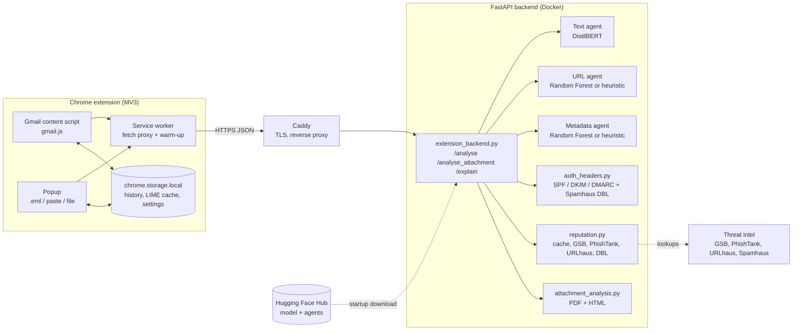
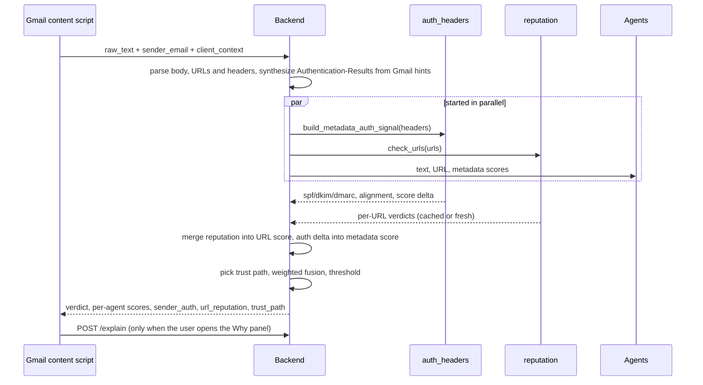
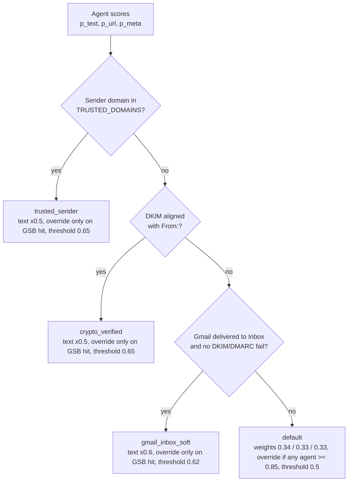
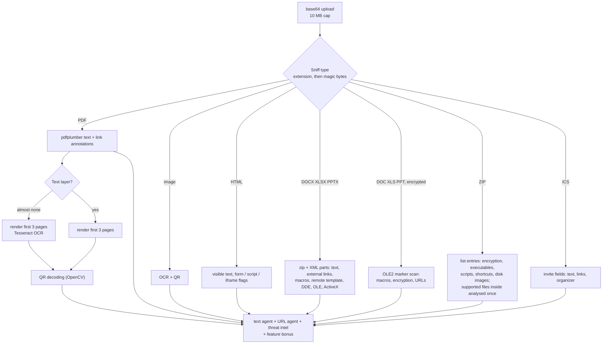

# Architecture

PhishLens has two runtime parts: a Chrome MV3 extension that lives inside
Gmail, and a FastAPI backend that does all the scoring. The extension
never classifies anything itself; it collects what it can see (body text,
sender, Gmail's own authentication hints, attachments) and renders the
backend's answer.

## Components

| Module | Responsibility |
| --- | --- |
| `extension/content_scripts/gmail.js` | Injects the scan buttons and verdict banner into Gmail, scrapes body, sender, `mailed-by` / `signed-by`, Inbox state, attachments |
| `extension/background.js` | Proxies requests to the backend (Gmail's CSP blocks direct fetches) and pings `/health` to keep the backend warm |
| `extension/lib/history.js`, `lime_cache.js` | Local scan history and analytics; SHA-256 keyed LIME cache |
| `backend/extension_backend.py` | HTTP API, request parsing, the three agents, fusion and trust paths, rate limiting, metrics |
| `backend/auth_headers.py` | RFC 7489 parsing of `Authentication-Results`, organisational-domain alignment, Spamhaus DBL on the From: domain |
| `backend/reputation.py` | URL reputation cascade with a SQLite cache and a daily Google Safe Browsing quota |
| `backend/attachment_analysis.py` | MIME sniffing, PDF and HTML text/URL extraction, risky-feature flags |
| `backend/feature_extraction.py` | Feature engineering shared with the training repo (the Random Forests depend on its exact output) |

## Request flow: `POST /analyse`

The LIME explanation is a separate call because it costs about 100 forward
passes. The verdict shows in a few seconds and the explanation streams in
afterwards; the extension caches it so reopening the same email is instant.

## Scoring and trust paths

Before the paths apply, two external signals are folded in: a Google Safe
Browsing hit lifts the URL score to at least 0.95, a hit from another
intel source blends into it, and the SPF/DKIM/DMARC result shifts the
metadata score (down by up to 0.3 for an aligned, fully passing sender;
up for each failure and by 0.6 for a Spamhaus-listed domain, clamped to
the 0 to 1 range). The chosen path is returned as
`trust_path` in the response and counted in the `phishlens_verdicts_total`
metric.

### Scoring reference

Base weights on the default path (constants in `extension_backend.py`):

| Knob | Value |
| --- | --- |
| `W_TEXT` / `W_URL` / `W_META` | 0.34 / 0.33 / 0.33 |
| `FUSION_THRESHOLD` | 0.5 |
| `HIGH_CONF_OVERRIDE` (any single agent) | 0.85 |

How each trust path changes them:

| Path | Text weight | Single-agent override | Threshold | Extra |
| --- | --- | --- | --- | --- |
| `trusted_sender` | x0.5 | only on a Safe Browsing hit | 0.65 | metadata score floored at 0.05 |
| `crypto_verified` | x0.5 | only on a Safe Browsing hit | 0.65 | |
| `gmail_inbox_soft` | x0.6 | only on a Safe Browsing hit | 0.62 | |
| `default` | x1.0 | any agent >= 0.85 | 0.5 | |

A Google Safe Browsing match on any link forces the phishing verdict on
every path: a trusted or signed sender carrying a blocklisted link means
the sending account is compromised.

**Precedence:** `trusted_sender > crypto_verified > gmail_inbox_soft >
default`. The allowlist (`TRUSTED_DOMAINS`) wins over DKIM alignment
because it covers institutions whose DKIM setup is sometimes broken. It
is Nigerian-centric by default (banks, telcos, universities); extend it
for your region. An empty allowlist is safe, just less forgiving on
legitimate transactional templates.

**Forwarded emails (v1.14):** when the body carries a forward marker
("Forwarded message", "Begin forwarded message:", "Message transféré",
...) or the subject starts with Fwd:/TR:, the sender only vouches for
the forward, not for the content. The allowlist, DKIM and Gmail-inbox
discounts are then switched off (default path), and the original sender
found in the forwarded block is returned in `forwarded`.

**Near-empty bodies (v1.14):** with fewer than 3 words (image-only
emails, a bare link) the text agent is left out: the URL and metadata
scores share the whole weight, and a confident text score cannot fire
the override. `text_agent_used` says which case applied.

**Link targets and shared files (v1.14):** the Gmail extension sends the
real `href` of every link in `client_context.link_urls` (the visible
text of "Click here" has no URL), so hidden links reach the URL agent
and the threat-intel cascade. Links to file-sharing and form services
(Google Drive / Docs / Forms, OneDrive, SharePoint, Dropbox, WeTransfer,
...) are listed in `shared_links` and shown as a warning, without
changing the score: the domain is legitimate, the shared file is the
lure.

**Why the discounts exist:** DistilBERT learned that "verify your
account" wording means phishing, and real bank, hospital and university
messages use the same templates. Discounting the text agent only when the
sender is proven (DKIM) or curated (allowlist) removes those false
positives without trusting whatever the From: header claims.

Attachments (`/analyse_attachment`) use a simpler rule: text and URL
agents at 0.5 each, plus a bonus for risky features (password field, PDF
auto-execute, and so on, capped at 0.7), threshold 0.55. If the parent
email was trusted, the text weight is halved and the threshold rises to
0.72, but a Safe Browsing hit still forces phishing.

### Attachment pipeline

| Flag | Bonus | Why it matters |
| --- | --- | --- |
| `contains_macros` | 0.45 | VBA or Excel 4.0 macros, the classic dropper |
| `remote_template` | 0.45 | Template fetched from a URL at open time (template injection) |
| `dde_field` | 0.40 | DDE field that can launch a command |
| `launch_external_action`, `auto_execute_on_open` | 0.35, 0.30 | PDF actions that run on open |
| `contains_password_field` | 0.40 | An HTML login page as an attachment is almost always phishing |
| `encrypted_document` | 0.30 | Password in the email body blinds scanners |
| `contains_activex` | 0.25 | ActiveX control in an Office file |
| `contains_qr_code` | 0.20 | "Quishing": the link is hidden from text scanners |
| `embedded_ole_object`, `external_data_connection` | 0.20 | Hidden payloads or remote data |
| `image_only_pdf` | 0.10 | No text layer: an evasion trick, but real scans exist too |
| `legacy_office_format` | 0.10 | Pre-2007 binary format |
| `disk_image_attachment`, `disk_image_in_archive` | 0.40 | ISO / IMG / VHD mount as a drive and skip the "downloaded file" warning |
| `encrypted_archive` | 0.35 | Password-protected ZIP: scanners cannot open it |
| `zip_bomb_suspected` | 0.30 | Compression ratio above 100 |
| `uninspectable_archive` | 0.20 | RAR / 7z, recognised but not opened |
| `nested_archive`, `calendar_with_links` | 0.10 | Archive in an archive; invite carrying links |

Macros, remote templates and DDE fields force the phishing verdict on
every path, and so (v1.14) do executables, scripts and shortcut files
(`.exe`, `.js`, `.lnk`, ...) attached directly or inside a ZIP, and
double extensions such as `invoice.pdf.exe`. They force the verdict even when the parent email is trusted: Gmail delivering the
email says nothing about what a macro does once enabled, and hijacked
accounts are how these documents usually travel.

Every step has a resource limit: 10 MB per upload, 3 OCR pages, a
10 s Tesseract timeout per page, images downscaled to 3000 px, a
decompression-bomb guard, and for Office files a cap on part count,
total uncompressed size (zip bombs) and part size. XML parts that
declare a DOCTYPE are skipped rather than parsed.

## Key design decisions

**DistilBERT rather than BERT-base.** About 40% smaller and 60% faster for
a few points of accuracy. The public demo runs on a CPU-only ARM VM, and
the extension needs a verdict in seconds, not tens of seconds.

**Three agents plus fusion rather than one bigger model.** Text, URLs and
headers fail in different ways. Separate agents keep each one small,
explainable, and replaceable (the URL and metadata agents fall back to
heuristics when the trained models are unavailable), and the per-agent
scores are shown to the user.

**Cryptographic sender checks over a pure allowlist.** An allowlist alone
trusts whatever the From: header claims. DKIM alignment proves the sender
domain, so a spoofed `From: paypal.com` signed by another domain stays on
the strict path. The allowlist is kept as a fallback for regional senders
with broken DKIM, and it is documented as such.

**Gmail's own verdict as a soft signal.** When the extension cannot read
the headers, the fact that Gmail delivered the message to Inbox (after its
own SPF/DKIM/DMARC checks) is used as a weak trust hint. It only softens
the text weight; it never overrides threat intelligence.

**Threat-intel cascade ordered by quality and cost.** Local cache first
(free), then Google Safe Browsing (best coverage, 10k/day quota tracked
in process), then PhishTank, URLhaus and Spamhaus DBL (free, weaker
coverage). Lookups run in parallel with model inference so they add
almost no latency.

**LIME on demand, cached client side.** Explanations are the slowest
operation. Making them a second request keeps verdicts fast, and the
SHA-256 keyed cache turns a repeat explanation into a local read.

**Two repositories.** Training code and notebooks change rarely and pull
heavy dependencies; the runtime should stay small and installable. The
models are the contract between the two, published on Hugging Face.

**Office parsing with the standard library.** Word, Excel and PowerPoint
files are read as ZIP + XML with `zipfile` and `ElementTree`, not with
python-docx or openpyxl: nothing to install, nothing that interprets
document content, and full control over size limits.

**Random Forests in the skops format.** Pickle (joblib) runs arbitrary
code when loaded. skops stores the same scikit-learn objects as data,
and the loader refuses any file that references a type outside
scikit-learn, NumPy, SciPy or the Python builtins.

**No accounts, no server-side storage of emails.** The backend is
stateless apart from the URL reputation cache (URLs and verdicts only).
Scan history lives in the user's browser.
