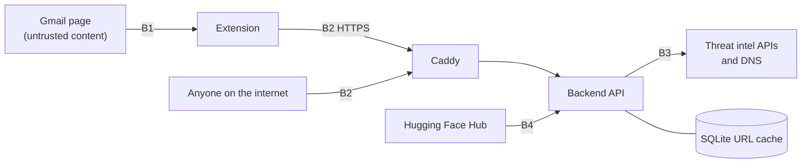

# Threat model

Scope: the PhishLens runtime (Chrome extension, FastAPI backend,
PhishLens Cloud at anzouk.duckdns.org). The training pipeline in PhishingDetector is
covered only where it affects the runtime (the published models).
Method: STRIDE per trust boundary, then a list of the risks we accept.

## Assets

| Asset | Why it matters |
| --- | --- |
| Email content sent for scanning | Private user data (body, sender, attachments) |
| Correctness of the verdict | A wrong "safe" on a phishing email is the main harm the tool can cause |
| Google Safe Browsing API key and daily quota | Leaking or exhausting it silently removes the strongest URL signal |
| Backend availability | PhishLens Cloud is shared by every extension user on the Cloud setting |
| Published models on Hugging Face | Loaded and unpickled by every backend at startup |
| The Oracle VM and its secrets (`.phishlens.env`) | Host compromise exposes all of the above |

## Trust boundaries

B1: email content controlled by the attacker reaches the extension.
B2: any HTTP client can reach the public API, not only the extension.
B3: the backend trusts answers from external intel services.
B4: the backend downloads and deserialises model files at startup.

## STRIDE analysis

| # | Threat | Boundary | Mitigation in place | Status |
| --- | --- | --- | --- | --- |
| S1 | **Spoofing** the sender: `From: paypal.com` sent from attacker infrastructure to borrow trust | B1 | Trust comes from DKIM alignment with the From: organisational domain, not from the header text. Misaligned `signed-by` stays on the strict path. Tested in `test_auth_headers.py` and `test_extension_backend.py` | Mitigated |
| S2 | Spoofing the client context: a caller claims `gmail_in_inbox` or `gmail_delivered` to soften its own scan | B2 | The flags only soften the caller's own result, never shared state; a Safe Browsing hit still forces phishing; documented as a SECURITY NOTE in code | Accepted (limited impact) |
| S3 | Trusted-domain abuse: a compromised account at an allowlisted bank sends phishing | B1 | A Safe Browsing hit forces phishing on every path, the allowlist included (regression test since v1.11.0); allowlist is small and documented as a regional fallback | Partially mitigated |
| T1 | **Tampering** with the model: a malicious joblib on Hugging Face (pickle executes code on load) | B4 | Since v1.12 the agents load from skops files with a type allowlist (scikit-learn, NumPy, SciPy, builtins only); pickle is a fallback that `AGENTS_ALLOW_PICKLE=0` turns off | Mitigated (skops files published and pickle disabled in production since 2026-09-30) |
| T2 | Cache poisoning: a wrong verdict stored in the reputation cache | B3 | Cache key is the normalised URL, values only come from the cascade itself, 24 h TTL | Mitigated |
| T3 | Adversarial text: wording crafted to push DistilBERT towards "safe" | B1 | Three independent agents plus threat intel; a clean text score does not hide a blocklisted URL or failed DMARC | Partially mitigated |
| R1 | **Repudiation**: no record of what was scanned | B2 | By design: the backend keeps no email content. Aggregate verdict counts only (`/metrics`) | Accepted |
| I1 | **Information disclosure**: users paste sensitive mail into the shared PhishLens Cloud test box | B2 | HTTPS only; no server-side storage of bodies; README warns not to send sensitive content to the demo; self-hosting is documented | Mitigated for transport, user choice otherwise |
| I2 | Error messages leak internals | B2 | Errors return a one-line message; FastAPI never returns stack traces to the client | Mitigated |
| I3 | Secrets in the repository or its history | n/a | `.phishlens.env` and `.env` are git-ignored; the GSB key only lives on the VM; history rewritten once to remove personal data | Mitigated |
| I4 | `/metrics` and `/reputation/stats` reveal traffic and quota usage | B2 | Contain counts only; operations guide shows how to block `/metrics` at Caddy | Mitigated when proxy rule applied |
| D1 | **Denial of service** by request flooding, or burning the 10k/day GSB quota | B2 | Per-IP rate limits (30/min analyse, 20/min attachments, 15/min explain); GSB quota tracked in process with a 500-request safety buffer; cache absorbs repeats | Mitigated |
| D2 | Oversized or malformed attachments exhausting CPU or memory | B2 | 10 MB cap, magic-byte sniffing, page limit on PDFs, unsupported types rejected with 400; OCR limited to 3 pages with a 10 s timeout each, images downscaled and guarded against decompression bombs; Office files capped on part count, uncompressed size (zip bombs) and part size | Mitigated |
| D5 | XML entity expansion or external entities in an Office file | B2 | Any XML part that declares a DOCTYPE is skipped and flagged `suspicious_xml_doctype`; ElementTree never fetches external entities | Mitigated |
| D3 | ReDoS through crafted headers or URLs | B1, B2 | CodeQL `py/polynomial-redos` enabled; the three findings fixed (bounded quantifiers, anchored matches, `email.utils.parseaddr` instead of a regex); regression test with a 50k-character From: header | Mitigated |
| D4 | Intel APIs slow or down | B3 | 3 s HTTP timeout per tier; each tier fails open to "no hit"; lookups run in parallel with inference | Mitigated |
| E1 | **Elevation of privilege** via the extension: a Gmail page scripting the extension | B1 | Content script reads the DOM but never evaluates page content; every backend or email value inserted into the banner goes through `escapeHTML`; host permissions limited to Gmail and the configured backends | Mitigated |
| E2 | Code execution through a malicious attachment | B2 | Parsing only (pdfplumber, BeautifulSoup, zipfile + ElementTree for Office); macros are detected, never run; PDF pages are rasterised by PDFium without JavaScript; container runs as a non-root user | Mitigated |
| E4 | CSV formula injection through the history export (an attacker-controlled subject such as `=HYPERLINK(...)`) | B1 | Cells starting with `= + - @` are prefixed with a quote in the export (v1.12), covered by a unit test | Mitigated |
| E3 | Supply chain: a compromised dependency or GitHub Action | n/a | Dependabot alerts and weekly updates, CI token limited to `contents: read`, CodeQL on every push | Mitigated |

## Residual risks and known limitations

**R1. False negatives are possible.** The models were evaluated offline
(F1 about 0.97 for text). Live traffic, new campaigns and adversarial
wording will do worse. PhishLens is an assistant, not a filter: the
verdict is advisory and the explanation is there so the user can judge.

**R2. English only.** Phishing in French, Hausa or Yoruba is outside the
training distribution.

**R3. Soft trust signals can be claimed by any API caller.** Accepted
because the effect is confined to that caller's own response.

**R4. Pickled model files. Closed.** Loading a joblib executes code by
design. Since v1.12 the agents are published as `.skops` files, loaded
with a type allowlist, and the production backend runs with
`AGENTS_ALLOW_PICKLE=0`, so it refuses pickle entirely. A self-hosted
backend that keeps the default (`1`) still falls back to joblib when no
skops file is found.

**R7. OCR and QR decoding are best effort.** Low-resolution scans,
handwriting, stylised fonts or deliberately damaged QR codes can defeat
them. The `image_only_pdf` flag still raises the score a little when
OCR finds nothing.

**R5. Shared open API.** PhishLens Cloud has no accounts: rate limits are
per IP and in memory, so they reset on restart and can be spread across
many IPs. Acceptable while the user base is small; with a public store
release, per-install API keys or a shared limiter (Redis) in front of
the API become worthwhile.

**R6. The allowlist is regional and static.** Useful for Nigerian
institutions with weak DKIM setups, but it trusts domains, not messages.

## Review triggers

Revisit this document when a new endpoint is added, when a new input
type is accepted (last review: v1.12, images and Office documents), when
the extension gets new permissions,
or when the deployment moves off the single VM.
