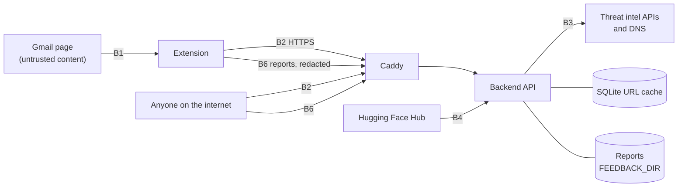

# Threat model

Scope: the PhishLens runtime (Chrome extension, FastAPI backend,
PhishLens Cloud at phishlens.dev). The training pipeline in PhishingDetector is
covered only where it affects the runtime (the published models).
Method: STRIDE per trust boundary, then a list of the risks we accept.

## Assets

| Asset | Why it matters |
| --- | --- |
| Email content sent for scanning | Private user data (body, sender, attachments) |
| Correctness of the verdict | A wrong "safe" on a phishing email is the main harm the tool can cause |
| Google Safe Browsing API key and daily quota | Leaking or exhausting it silently removes the strongest URL signal |
| Backend availability | PhishLens Cloud is shared by every extension user on the Cloud setting |
| Published models on Hugging Face | Loaded by every backend at startup; the text model decides the wording score |
| Hugging Face read token (`HF_TOKEN`, only when the text model is in a private repository) | Read access to that repository |
| The Oracle VM and its secrets (`.phishlens.env`) | Host compromise exposes all of the above |
| Reports users send (`FEEDBACK_DIR`) | Redacted email text: still private content, and future training data |

## Trust boundaries

```mermaid
flowchart LR
    U["Gmail page<br/>(untrusted content)"] -->|B1| E["Extension"]
    E -->|B2 HTTPS| P["Caddy"] --> A["Backend API"]
    X["Anyone on the internet"] -->|B2| P
    A -->|B3| I["Threat intel APIs<br/>and DNS"]
    H["Hugging Face Hub"] -->|B4| A
    A --- C[("SQLite URL cache")]
    E -->|B6 reports, redacted| P
    X -->|B6| P
    A --- F[("Reports<br/>FEEDBACK_DIR")]
```

B1: email content controlled by the attacker reaches the extension.
B2: any HTTP client can reach the public API, not only the extension.
B3: the backend trusts answers from external intel services.
B4: the backend downloads and deserialises model files at startup.
B5: the extension's own interface texts (translations) are shipped with
the extension and never come from the network.
B6: anyone can post a report to `/feedback`, not only the extension.

## STRIDE analysis

| # | Threat | Boundary | Mitigation in place | Status |
| --- | --- | --- | --- | --- |
| S1 | **Spoofing** the sender: `From: paypal.com` sent from attacker infrastructure to borrow trust | B1 | Trust comes from DKIM alignment with the From: organisational domain, not from the header text; the allowlist also requires it since v2.0 (before, a forged allowlisted From: got the trusted path). Misaligned `signed-by` stays on the strict path. A brand's name over another domain's address ("Chronopost <x@random.us>") cancels the softer paths and raises the sender score, since 2.0.7 (`test_impersonation_and_links.py`). Tested in `test_auth_headers.py` and `test_extension_backend.py` | Mitigated |
| S2 | Spoofing the client context: a caller claims `gmail_in_inbox` or `gmail_delivered` to soften its own scan | B2 | The flags only soften the caller's own result, never shared state; a Safe Browsing hit still forces phishing; documented as a SECURITY NOTE in code | Accepted (limited impact) |
| S3 | Trusted-domain abuse: a compromised account at an allowlisted bank sends phishing | B1 | A Safe Browsing hit forces phishing on every path, the allowlist included (regression test since v1.11.0); allowlist is small and documented as a regional fallback | Partially mitigated |
| T1 | **Tampering** with the model: a malicious joblib on Hugging Face (pickle executes code on load) | B4 | Since v1.12 the agents load from skops files with a type allowlist (scikit-learn, NumPy, SciPy, builtins only); pickle is a fallback that `AGENTS_ALLOW_PICKLE=0` turns off | Mitigated (skops files published and pickle disabled in production since 2026-09-30) |
| T2 | Cache poisoning: a wrong verdict stored in the reputation cache | B3 | Cache key is the normalised URL, values only come from the cascade itself, 24 h TTL | Mitigated |
| T4 | A tampered PhishTank feed, or a PhishTank entry on a shared host (`bit.ly`, `storage.googleapis.com`) flagging every link of that host | B3 | Feed downloaded over HTTPS only; on hosts that serve many unrelated users, only the exact URL matches, never the whole domain (`SHARED_PATH_HOSTS`) | Mitigated |
| T5 | A replaced or wrong text model: `HF_MODEL_REPO` changed, a new revision pushed to the repository | B4 | Weights loaded through `transformers`, which prefers safetensors files (data only) when the repository provides them; one folder per repository so a switch never mixes models; `/health` reports the repository, revision, name and settings in use; `HF_MODEL_REVISION` and `HF_AGENTS_REVISION` pin the exact commits (a warning is logged when they are not set); only the maintainer can push to the repository | Mitigated when the revisions are pinned |
| T3 | Adversarial text: wording crafted to push DistilBERT towards "safe" | B1 | Three independent agents plus threat intel; a clean text score does not hide a blocklisted URL or failed DMARC | Partially mitigated |
| R1 | **Repudiation**: no record of what was scanned | B2 | By design: the backend keeps no email content. Aggregate verdict counts only (`/metrics`) | Accepted |
| I5 | A report carries personal data the redaction missed (a name without greeting, a street address) | B6 | Redaction in the browser and again on the server, preview with edit and confirmation before sending, no IP stored, private folder, two-year limit, deletion by reference, human review before any use | Partially mitigated (redaction is rule-based) |
| T6 | Poisoning: fake reports pushing the next model towards wrong labels | B6 | Rate limit per IP, size and storage caps, strict validation; reports are never used for training without being read and relabelled by hand | Mitigated |
| I1 | **Information disclosure**: users paste sensitive mail into the shared PhishLens Cloud test box | B2 | HTTPS only; no server-side storage of bodies; README warns not to send sensitive content to the demo; self-hosting is documented | Mitigated for transport, user choice otherwise |
| I2 | Error messages leak internals | B2 | Errors return a one-line message with a short reference; the stack trace is logged on the server under that reference and never returned | Mitigated |
| I3 | Secrets in the repository or its history | n/a | `.phishlens.env` and `.env` are git-ignored; the GSB key only lives on the VM; history rewritten once to remove personal data | Mitigated |
| I4 | `/metrics` and `/reputation/stats` reveal traffic and quota usage | B2 | Contain counts only; operations guide shows how to block `/metrics` at Caddy | Mitigated when proxy rule applied |
| D1 | **Denial of service** by request flooding, or burning the 10k/day GSB quota | B2 | Per-IP rate limits (30/min analyse, 20/min attachments, 15/min explain); GSB quota tracked in process with a 500-request safety buffer; cache absorbs repeats | Mitigated |
| D6 | Oversized requests, or CPU-bound inference blocking the server for everyone | B2 | Bodies above 45 MB refused with 413 before parsing; every field has a maximum length; model inference and attachment parsing run in a worker thread so the event loop keeps serving `/health` and other requests | Mitigated |
| D2 | Oversized or malformed attachments exhausting CPU or memory | B2 | 10 MB cap, magic-byte sniffing, page limit on PDFs, unsupported types rejected with 400; OCR limited to 3 pages with a 10 s timeout each, images downscaled and guarded against decompression bombs; Office files capped on part count, uncompressed size (zip bombs) and part size | Mitigated |
| D5 | XML entity expansion or external entities in an Office file | B2 | Any XML part that declares a DOCTYPE is skipped and flagged `suspicious_xml_doctype`; parts are parsed with `defusedxml`, which refuses entity tricks | Mitigated |
| D3 | ReDoS through crafted headers or URLs | B1, B2 | CodeQL `py/polynomial-redos` enabled; the three findings fixed (bounded quantifiers, anchored matches, `email.utils.parseaddr` instead of a regex); regression test with a 50k-character From: header | Mitigated |
| D4 | Intel APIs slow or down | B3 | 3 s HTTP timeout per tier; each tier fails open to "no hit"; lookups run in parallel with inference | Mitigated |
| E1 | **Elevation of privilege** via the extension: a Gmail page scripting the extension | B1 | Content script reads the DOM but never evaluates page content; no HTML is built from strings: every backend or email value, translated texts included (they can carry the sender or a file name), becomes a text node or an attribute value (`h()` in `lib/dom.js`); a unit test fails on any `innerHTML`; host permissions limited to Gmail, Outlook and the configured backends | Mitigated |
| E2 | Code execution through a malicious attachment | B2 | Parsing only (pdfplumber, BeautifulSoup, zipfile + ElementTree for Office); macros are detected, never run; PDF pages are rasterised by PDFium without JavaScript; container runs as a non-root user | Mitigated |
| E4 | CSV formula injection through the history export (an attacker-controlled subject such as `=HYPERLINK(...)`) | B1 | Cells starting with `= + - @` are prefixed with a quote in the export (v1.12), covered by a unit test | Mitigated |
| E3 | Supply chain: a compromised dependency or GitHub Action | n/a | Dependabot alerts and weekly updates, CI token limited to `contents: read`, CodeQL on every push | Mitigated |

## Residual risks and known limitations

**R1. False negatives are possible.** The models were evaluated offline
(on unseen real mail at the 0.7 threshold, the multilingual text model
catches 92.5% of English and 87.4% of French phishing). Live traffic, new campaigns and adversarial
wording will do worse. PhishLens is an assistant, not a filter: the
verdict is advisory and the explanation is there so the user can judge.

**R2. Not every language is read equally well.** PhishLens Cloud's
text model was trained on 22 languages, but measured on real phishing
only in English, French, German, Dutch, Portuguese and Spanish; for the
other languages (Hausa or Yoruba, for example) its wording score is less
proven. A self-hosted server keeps the English DistilBERT unless
`HF_MODEL_REPO` says otherwise. The link, sender and threat-intelligence
checks do not depend on the language
([languages.md](languages.md#text-model)).

**R9. A phishing domain that signs its own mail gets the softer path.**
DKIM aligned with the From: domain proves who sent the email, not that
the sender is honest, and an attacker sets it up for their own domain.
On that `crypto_verified` path the text weighs half and only Safe
Browsing forces the verdict: 38 of the 64 phishing emails the 2.0.8
benchmark missed went through it. Sending unlisted domains to the
default path, or letting a text score of 0.95 decide there, catches
about 7 points more phishing, but on real inbox mail it doubled the
false alarms: legitimate notifications from unlisted, DKIM-signed
domains score as high as phishing. Since 2.0.10 the discount no longer
holds when every link leads away from the sender's domain and the
wording looks like phishing (`CRYPTO_LINK_RULE`): on fresh phishing,
the misses on that path fell from about 191 to 81 out of 2,000, with no
more false alarms. Signed phishing that links to its own domain, sends
no link, or goes through click tracking still gets the discount
([evaluation](evaluation.md#results)).

**R8. The Hausa interface is a draft translation.** A wrong word in a
warning could confuse a reader. It is marked for review by a native
speaker; English stays available in Settings.

**R3. Soft trust signals can be claimed by any API caller.** Accepted
because the effect is confined to that caller's own response.

**R4. Pickled model files. Closed.** Loading a joblib executes code by
design. Since v1.12 the agents are published as `.skops` files, loaded
with a type allowlist, and the production backend runs with
`AGENTS_ALLOW_PICKLE=0`, so it refuses pickle entirely. A self-hosted
backend that keeps the default (`1`) still falls back to joblib when no
skops file is found.

**R7. OCR and QR decoding are best effort.** Low-resolution scans,
handwriting, stylised fonts or deliberately damaged QR codes can defeat
them. The `image_only_pdf` flag still raises the score a little when
OCR finds nothing.

**R5. Shared open API.** PhishLens Cloud has no accounts: rate limits are
per IP and in memory, so they reset on restart and can be spread across
many IPs. Acceptable while the user base is small; with a public store
release, per-install API keys or a shared limiter (Redis) in front of
the API become worthwhile.

**R6. The allowlist is regional and static.** It only applies to
authenticated senders (since v2.0), so it trusts authenticated domains,
not messages: a compromised account at a listed institution is caught
only by threat intelligence or the link checks.

## Review triggers

Revisit this document when a new endpoint is added, when a new input
type is accepted, when the extension gets new permissions, when the text
model changes, or when the deployment moves off the single VM. Last
review: v2.0 (authenticated allowlist, request limits, user reports, model
configuration file, interface translations).
